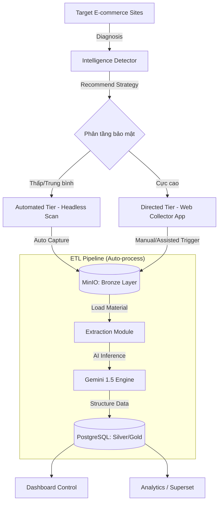

# 🚀 Marketplace Smart Crawler & Lakehouse Platform

[](https://www.python.org/downloads/)
[](https://playwright.dev/)
[](https://ai.google.dev/)
[](https://min.io/)
[](https://www.postgresql.org/)

**Marketplace Smart Crawler** là một nền tảng Lakehouse hiện đại, tích hợp AI để tự động hóa quy trình thu thập, phân tích và quản trị dữ liệu thị trường (Rượu bia, Thuốc lá, Sữa) từ các nền tảng thương mại điện tử lớn tại Việt Nam.

---

## 🌟 Tầm Nhìn Dự Án

Dự án không chỉ là một công cụ cào dữ liệu đơn thuần, mà là một **Nền tảng Dữ liệu Thị trường (Marketplace Data Platform)** hoàn chỉnh. Hệ thống giải quyết bài toán thu thập dữ liệu bằng cách kết hợp sức mạnh của **Generative AI (Gemini)** và kiến trúc **Medallion Lakehouse**, cho phép tùy biến linh hoạt giữa tự động hóa và sự can thiệp có chủ đích đối với các trang web bảo mật cao.

## ✨ Tính Năng Cốt Lõi

- **🧠 Intelligence Site Discovery**: Tự động khám phá cấu trúc web (Category, Product patterns) bằng **Gemini 1.5 Flash**. Đề xuất chiến lược thu thập tối ưu.
- **🛡️ Adaptive Scraping Engine**: Sử dụng Playwright kết hợp với AI để tự động xử lý Selector và vượt qua các cơ chế chống bot.
- **🏗️ Kiến trúc Medallion Lakehouse**:
  - **🥉 Bronze (MinIO)**: Lưu trữ MHTML/HTML thô - Đảm bảo tính minh bạch và khả năng tái xử lý (Re-processability).
  - **🥈 Silver (JSONB)**: Dữ liệu thô đã được parse và lưu trữ dưới dạng JSON có cấu trúc trung gian.
  - **🥇 Gold (PostgreSQL)**: Dữ liệu sạch, chuẩn hóa, sẵn sàng cho Business Intelligence và Analytics.
- **🔄 Automated Pipeline**: Tích hợp **Apache Airflow** để điều phối các luồng dữ liệu theo lịch trình.
- **🔍 Smart Deduplication**: Sử dụng **Redis** để khử trùng lặp dữ liệu cực nhanh.

---

## 🏗️ Kiến Trúc Hệ Thống & Chiến Lược Phân Tầng

Hệ thống được thiết kế để tối ưu hóa giữa tính tự động hóa và khả năng vượt rào cản kỹ thuật (WAF, Cloudflare, Robot-check):



### 🛠️ Phân tầng chiến lược thu thập

| Tầng (Tier) | Đối tượng áp dụng | Cơ chế hoạt động | Mức độ tự động |
| :--- | :--- | :--- | :--- |
| **Automated (Tự động)** | Web thông thường, bảo mật thấp/trung bình. | Chạy toàn bộ qua Airflow DAG & Headless Playwright. | **100% (Scheduled)** |
| **Directed (Hybrid)** | Các sàn TMĐT lớn (Shopee, Lazada...) với bảo mật cực cao. | Web Collector App mở trình duyệt thật để người dùng trigger snapshot. | **50% (Assisted)** |

---

## 📂 Sơ Đồ Tổ Chức Mã Nguồn

```text
├── src/                    # Mã nguồn chính của ứng dụng
│   ├── modules/           
│   │   ├── detector/       # AI mapping cấu trúc website & chẩn đoán chiến lược
│   │   ├── scraper/        # Engine cào tự động và xử lý Playwright
│   │   ├── collector/      # Quản lý file, trạng thái thu thập và Web App
│   │   └── collector_strategies/ # Triển khai các chiến lược thu thập đa dạng
│   ├── apps/               # API Backend & Dashboard điều khiển
│   └── core/               # Các lớp core (Database, Object Storage, Logging)
├── infra/                  # Hạ tầng và Cấu hình triển khai
│   ├── docker/             # Dockerfiles, Compose & Scripts khởi tạo
│   ├── airflow/            # Định nghĩa các DAGs & Orchestration logic
│   └── migrations/         # Quản lý schema database (Alembic/PostgreSQL)
├── scripts/                # Tập hợp các script vận hành, backup và demo
└── docs/                   # Tài liệu chi tiết kỹ thuật và quy trình nghiệp vụ
```

---

## 🚀 Hướng Dẫn Cài Đặt

### 1. Yêu Cầu Hệ Thống

- **Docker & Docker Compose** (Khuyến nghị)
- **Python 3.10+** (Nếu chạy local)
- **Google AI Studio API Key** (Sử dụng Gemini AI)

### 2. Khởi Chạy Nhanh với Docker

```bash
# 1. Clone repository
git clone <repository-url>
cd ruoubia-thuocla-sua

# 2. Cấu hình môi trường
cp .env.example .env
# Chỉnh sửa .env và điền GEMINI_API_KEY cùng thông tin database

# 3. Build và khởi chạy (Postgres, MinIO, Redis, Airflow, API)
make dev
```

---

## 🛠️ Cách Vận Hành

### A. Sử dụng Intelligence Detector

Chẩn đoán cấu trúc website trước khi thiết lập luồng cào:

```bash
# PowerShell:
$env:PYTHONPATH="src"; python -m modules.detector.main --url https://example.com
```

### B. Thu thập trang bảo mật cao (Web Collector App)

Dành cho luồng **Directed Tier**, cần sự can thiệp của người dùng:

```bash
python src/modules/collector/run.py
```

### C. Tự động hóa hàng tháng (Airflow)

Luồng **Automated Tier** chạy mặc định qua DAG `monthly_full_refresh` vào ngày 1 mỗi tháng. Cấu hình danh sách domain tại `infra/airflow/dags/domain_cadence.json`.

---

## 📈 Lộ Trình Phát Triển (Roadmap)

- [x] Kiến trúc Lakehouse đa tầng (Bronze/Silver/Gold).
- [x] Chiến lược thu thập phân tầng (Automated/Directed).
- [x] Tích hợp AI Gemini cho trích xuất tự động.
- [ ] Triển khai Drift Detection (Phát hiện website thay đổi cấu trúc).
- [ ] Tích hợp hệ thống quản trị chất lượng dữ liệu (Data Quality Check).

---

## 🤝 Đóng Góp

Chúng tôi hoan nghênh mọi đóng góp. Vui lòng tạo **Issue** hoặc gửi **Pull Request**.

---
*Phát triển bởi Đội ngũ Data Engineering & AI - 2026*
