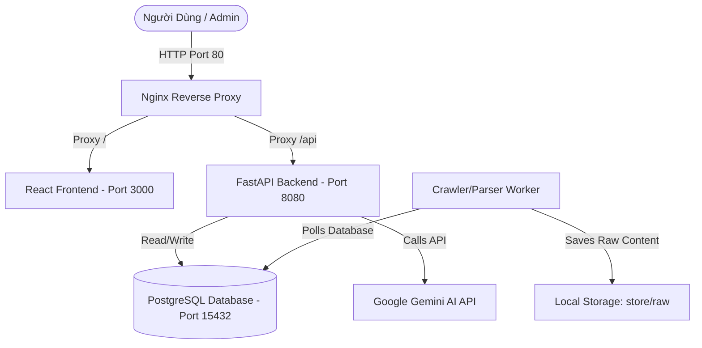

# Admin Center - Bộ Quản Trị Hệ Thống Thu Thập Dữ Liệu Sản Phẩm (Rượu, Bia, Thuốc lá, Sữa)

Dự án Admin Center là hệ thống quản trị trung tâm phục vụ cho việc vận hành luồng thu thập dữ liệu sản phẩm, phân tích quy tắc trích xuất bằng AI (Gemini), quản lý lịch sử giá và chuẩn hóa thông tin sản phẩm. 

Hệ thống được thiết kế theo kiến trúc Microservices và đóng gói hoàn toàn bằng Docker, giúp dễ dàng triển khai, reset và bảo trì.

---

## 🏗️ Kiến Trúc Hệ Thống (System Architecture)

Sơ đồ hoạt động và kết nối giữa các dịch vụ trong hệ thống:



### Chi tiết các dịch vụ trong Docker Stack:
- **`nginx` (nginx:1.27-alpine)**: Điểm truy cập duy nhất (Entrypoint), phân luồng request đến Frontend hoặc API Backend, hỗ trợ CORS và bảo mật SSL.
- **`frontend` (React/Vite)**: Giao diện quản trị Dashboard tương tác trực quan.
- **`backend` (FastAPI/Python)**: Cung cấp API quản lý nguồn, pipeline, chạy crawl, quản lý quy tắc trích xuất và giao tiếp với Gemini.
- **`worker` (Python Worker)**: Tiến trình chạy nền (Background Cron Worker) chịu trách nhiệm kích hoạt pipeline, tải trang thô (raw page HTML) và áp dụng các quy tắc trích xuất để ghi nhận sản phẩm.
- **`postgres` (PostgreSQL 15)**: Cơ sở dữ liệu trung tâm lưu trữ thông tin cấu hình nguồn (`sources`), lịch sử chạy (`admin_pipeline_runs`), và sản phẩm trích xuất (`sc_products`).

---

## ⚙️ Cấu Hình Môi Trường (.env)

Hệ thống sử dụng một file `.env` duy nhất tại thư mục gốc để quản lý toàn bộ tham số runtime.

### Các biến cấu hình quan trọng:
| Biến Môi Trường | Giá Trị Mặc Định | Mô Tả |
| :--- | :--- | :--- |
| `ENV` | `development` | Chế độ chạy hệ thống (`development` hoặc `production`). |
| `POSTGRES_DB` | `admin_center` | Tên cơ sở dữ liệu PostgreSQL. |
| `POSTGRES_USER` | `admin_center` | Tài khoản kết nối cơ sở dữ liệu. |
| `POSTGRES_PASSWORD` | `admin_center_password` | Mật khẩu cơ sở dữ liệu. |
| `HOST_POSTGRES_PORT` | `15432` | **Quan trọng:** Port ánh xạ Postgres ra máy host để tránh xung đột với các ứng dụng khác sử dụng port mặc định `5432`. |
| `DATABASE_URL` | `postgresql://...` | Connection String dùng cho Backend/Worker kết nối tới Postgres. |
| `HOST_HTTP_PORT` | `80` | Port truy cập ứng dụng trên trình duyệt máy host. |
| `GEMINI_API_KEY` | *(Khóa của bạn)* | API Key của Google Gemini dùng để tự động phân tích cấu trúc trang web và trích xuất dữ liệu. |
| `USE_MOCK_MODE` | `true` | Bật chế độ giả lập nếu không có API Key của Gemini. |

---

## 🚀 Hướng Dẫn Cài Đặt Từ Đầu (Fresh Installation)

### 1. Yêu Cầu Hệ Thống
- **Docker Desktop** (đã bật chế độ Linux Containers).
- **Git** (để quản lý mã nguồn).
- **Python 3.11+** và **Node.js 18+** (không bắt buộc, chỉ cần nếu chạy/test ngoài Docker).

### 2. Thiết Lập Môi Trường
1. Sao chép file cấu hình mẫu:
   ```bash
   copy .env.example .env
   ```
2. Mở file `.env` và kiểm tra cấu hình. Đảm bảo điền đầy đủ `GEMINI_API_KEY` của bạn để các tính năng AI hoạt động chính xác.

### 3. Khởi Chạy Hệ Thống
Chạy lệnh sau tại thư mục gốc để Docker tự động build hình ảnh và kích hoạt toàn bộ container:
```bash
docker compose up -d --build
```

### 4. Kiểm Tra Trạng Thái
Sau khi khởi động, chạy lệnh sau để kiểm tra trạng thái các container:
```bash
docker compose ps
```
Truy cập các endpoint sau trên trình duyệt hoặc qua `curl` để kiểm tra kết quả:
- **Trang quản trị (UI)**: [http://localhost](http://localhost) (Hoặc port cấu hình trong `HOST_HTTP_PORT`).
- **Health Check API**: [http://localhost/api/health](http://localhost/api/health) (Trả về `{"status":"ok"}`).
- **Database Connection Check**: [http://localhost/api/ready](http://localhost/api/ready) (Trả về `{"status":"ready"}`).

---

## 🔄 Hướng Dẫn Reset Hệ Thống Sạch (Clean Slate System Reset)

Khi bạn muốn xóa sạch toàn bộ dữ liệu (cơ sở dữ liệu, lịch sử chạy, trang thô, log) để khởi động lại hệ thống như mới, hãy thực hiện quy trình 4 bước sau:

### Bước 1: Dừng các container và Xóa volume dữ liệu
Chạy lệnh sau để hạ tất cả container và **xóa sạch volume persistent của PostgreSQL** (cờ `-v`):
```bash
docker compose down -v
```

### Bước 2: Dọn dẹp tệp tin lưu trữ tạm thời trên máy host
Xóa toàn bộ các tệp tin HTML thô và kết quả thu thập tạm thời được đồng bộ dưới thư mục `store/` để tránh rác dữ liệu:
- **Trên Windows (PowerShell):**
  ```powershell
  Remove-Item -Path "store/raw", "store/outputs", "store/admin" -Recurse -Force -ErrorAction SilentlyContinue
  ```
- **Trên Linux / macOS:**
  ```bash
  rm -rf store/raw store/outputs store/admin
  ```

### Bước 3: Tạo lại các thư mục trống và Phân quyền truy cập
Để tránh lỗi `Permission denied` khi các Docker container cố ghi file vào thư mục mount, hãy tạo lại các thư mục trống và phân quyền:
- **Trên Windows (PowerShell):**
  ```powershell
  New-Item -ItemType Directory -Path "store/raw", "store/outputs", "store/admin" -Force
  icacls store /grant "Everyone:(OI)(CI)F"
  ```
- **Trên Linux / macOS:**
  ```bash
  mkdir -p store/raw store/outputs store/admin
  chmod -R 777 store
  ```

### Bước 4: Khởi động lại hệ thống
Kích hoạt lại hệ thống. Lúc này, PostgreSQL sẽ được tạo mới hoàn toàn, và tự động thực thi file `scripts/postgres-init.sql` để thiết lập lại các bảng và **tự động nạp (seed) lại toàn bộ 28 nguồn dữ liệu chuẩn**:
```bash
docker compose up -d
```

---

## 📊 Vận Hành & Thu Thập Dữ Liệu (Operations Guide)

### 1. Tự Động Nạp Nguồn (Seeding)
Sau khi reset hệ thống ở bước trên, cơ sở dữ liệu sẽ tự động chứa **28 nguồn dữ liệu** (bao gồm các chuỗi siêu thị lớn như *Bách Hóa Xanh, TH true Mart, WinMart, Vinamilk*, các cửa hàng rượu nhập khẩu, và nguồn kiểm thử *Example Site*). Không cần import CSV thủ công.

### 2. Kích Hoạt Lượt Chạy Thu Thập
1. Truy cập trang quản trị hệ thống tại [http://localhost](http://localhost).
2. Di chuyển đến tab **Nguồn dữ liệu** (Sources).
3. Tìm nguồn muốn chạy (ví dụ: `Example Site`).
4. Nhấn nút **Chạy** (Run) ở góc phải của dòng.
5. Hệ thống sẽ kích hoạt một pipeline thu thập chạy ngầm và hiển thị thông báo trạng thái.

### 3. Kiểm Tra Kết Quả
- Di chuyển sang tab **Lượt chạy** (Pipeline Runs) để theo dõi tiến độ.
- Hệ thống áp dụng **Quality Gate (Cổng kiểm soát chất lượng)** cực kỳ nghiêm ngặt. Nếu Gemini sinh ra quy tắc trích xuất (Extraction Rule) có điểm chất lượng thấp (dưới `0.72`), lượt chạy sẽ có trạng thái **Bị chặn** (Blocked) để ngăn chặn rác dữ liệu đi vào kho sản phẩm chính thức.

---

## 🛠️ Xử Lý Sự Cố Thường Gặp (Troubleshooting)

### 1. Lỗi cổng kết nối đã bị sử dụng (`Bind for 0.0.0.0:5432 failed: port is already allocated`)
- **Nguyên nhân**: Máy host của bạn đã có một dịch vụ PostgreSQL khác đang chạy ở port `5432`.
- **Khắc phục**: Đảm bảo cấu hình `HOST_POSTGRES_PORT=15432` (hoặc một port trống bất kỳ) trong file `.env` trước khi khởi chạy docker.

### 2. Lỗi phân quyền ghi tệp tin (`Permission denied: '/app/store/raw'`)
- **Nguyên nhân**: Thư mục `store/raw` bị xóa và khi Docker tạo lại, tiến trình container (chạy dưới User ID khác) không có quyền ghi.
- **Khắc phục**: Thực hiện lệnh tạo thư mục từ máy host và cấp quyền rộng (xem **Bước 3** trong quy trình Reset).

### 3. Lỗi hết hạn ngạch Gemini (`429 Quota Exceeded`)
- **Nguyên nhân**: Sử dụng tài khoản Gemini miễn phí (Free Tier) bị giới hạn số request trên mỗi phút.
- **Khắc phục**: Chờ khoảng 1-2 phút rồi chạy lại, hoặc cập nhật API Key trả phí (Pay-as-you-go) trong `.env`.

---

*Mọi tài liệu và báo cáo kiểm thử trước đó được lưu trữ chi tiết trong thư mục `artifacts/`.*
