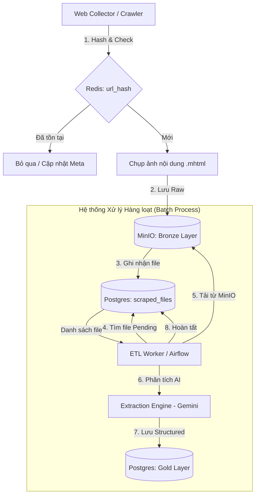

# 🏗️ Kiến trúc Hệ thống Thu thập & Xử lý Dữ liệu Lakehouse

Tài liệu này mô tả thiết kế tích hợp giữa **MinIO (Object Storage)**, **Redis (Cache)** và **PostgreSQL (Structured Data)** để tối ưu hóa quy trình thu thập và trích xuất dữ liệu sản phẩm.

---

## 1. Sơ đồ Luồng Dữ liệu (Data Pipeline)



---

## 2. Các tầng Dữ liệu (Data Layers)

### 🥉 Tầng Đồng (Bronze Layer) - MinIO

- **Mục đích:** Lưu trữ bản gốc (Source of Truth) của các trang web.
- **Định dạng:** `.mhtml` (Single file, chứa cả ảnh/CSS).
- **Đường dẫn:** `raw/[nguồn]/[ngày]/[url_hash].mhtml`.
- **Ưu điểm:** Cho phép chạy lại (Re-run) logic trích xuất mà không cần tốn chi phí crawl lại trang web.

### 🥈 Tầng Bạc (Silver Layer) - JSON Metadata

- **Mục đích:** Lưu trữ dữ liệu thô đã được parse từ HTML nhưng chưa được chuẩn hóa hoàn toàn.
- **Cấu trúc:** Lưu trực tiếp vào cột `raw_data` (JSONB) của PostgreSQL.

### 🥇 Tầng Vàng (Gold Layer) - PostgreSQL

- **Mục đích:** Dữ liệu đã sạch, chuẩn hóa, sẵn sàng cho phân tích (BI/Analytics).
- **Bảng chính:** `products`, `prices`, `stores`.

---

## 3. Các thành phần Kỹ thuật Tối ưu

### A. Khử trùng lặp (Deduplication) - Redis

Sử dụng Redis để kiểm tra nhanh URL đã được crawl hay chưa.

- **Key:** `crawler:visited:[domain]`
- **Value:** Bitset hoặc HASH của URL.
- **Hiệu năng:** Kiểm tra trùng lặp trong < 1ms.

### B. Quản lý trạng thái File - Postgres `scraped_files`

Lưu vết từng object trong MinIO để quản lý vòng đời xử lý.

- `status`: `pending`, `processing`, `completed`, `failed`.
- `scraped_at`: Thời điểm thu thập.
- `processed_at`: Thời điểm hoàn thành trích xuất AI.

### C. Cơ chế Upsert (Insert or Update)

Khi lưu vào Gold Layer, sử dụng:

```sql
INSERT INTO products (...)
ON CONFLICT (url_hash) 
DO UPDATE SET price = EXCLUDED.price, last_updated = NOW();
```

Giúp duy trì lịch sử biến động giá mà không tạo bản ghi trùng lặp.

---

## 4. Ưu điểm của Kiến trúc

1. **Khả năng phục hồi:** Nếu logic AI thay đổi, chỉ cần chạy lại Worker trên đống file `.mhtml` cũ.
2. **Khả năng mở rộng:** Dễ dàng thêm các Worker ETL mới để xử lý song song.
3. **Tính minh bạch:** Mọi dữ liệu structured đều có thể truy vết về file `raw` ban đầu trong MinIO.

---
*Cập nhật: 2026-04-26*
