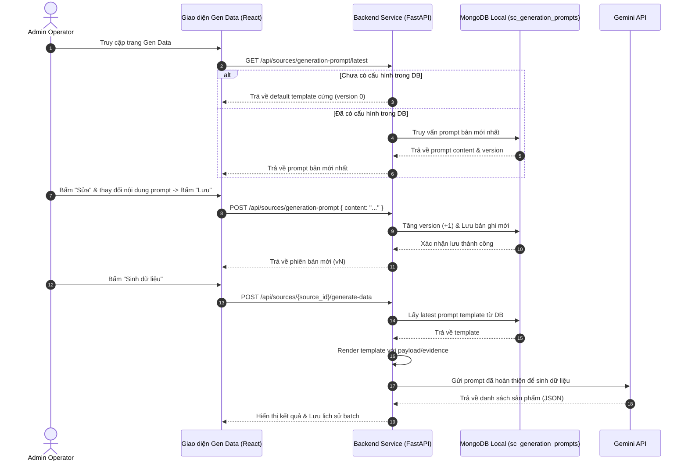

# Hệ Thống Quản Lý Prompt Phiên Bản (Prompt Version Control)

Chúng tôi đã thiết kế và triển khai thành công hệ thống quản lý prompt phiên bản cho tính năng **Gen Data** trong Trung tâm Quản trị (Admin Center). Hệ thống này cho phép hiển thị, chỉnh sửa trực tiếp và lưu trữ lịch sử phiên bản của các prompt cấu hình AI ngay từ giao diện điều khiển, giúp loại bỏ các prompt hardcoded và tăng khả năng kiểm soát luồng sinh dữ liệu.

## 1. Sơ đồ Kiến trúc & Luồng dữ liệu

Dưới đây là mô hình hoạt động giữa Giao diện Operator, API Backend, và Cơ sở dữ liệu MongoDB Local:

---

## 2. Giao diện Vận hành Thực tế

Dưới đây là hình ảnh thực tế của bảng điều khiển **Quản lý Gen Data** sau khi tích hợp cột **CẤU HÌNH PROMPT (V1)** ở chính giữa, cho phép tương tác trực tiếp:

---

## 3. Các thay đổi đã thực hiện

### A. Tầng Cơ sở dữ liệu (`mongo_store.py`)
- Bổ sung collection `sc_generation_prompts` trong MongoDB local.
- Thêm 3 phương thức nghiệp vụ:
  1. `get_latest_prompt(key)`: Lấy phiên bản prompt mới nhất.
  2. `save_new_prompt_version(key, content)`: Tự động tính số version mới (+1) và lưu lịch sử.
  3. `list_prompt_versions(key)`: Lấy toàn bộ danh sách phiên bản cũ giảm dần theo số version.

### B. Tầng Tích hợp dịch vụ AI (`gemini_service.py`)
- Thêm hàm `get_synthetic_data_prompt_template()` hỗ trợ tự động tải prompt từ DB hoặc fallback về prompt mặc định nếu DB trống.
- Cải tiến hàm `build_synthetic_data_prompt()` để định dạng động các placeholder `{mode_instruction}`, `{payload}`, `{evidence_block}`, và `{payload_schema}` từ template DB một cách an toàn và chống crash tuyệt đối (auto-fallback).

### C. Tầng API Endpoints (`routes/sources.py` & `schemas.py`)
- Khai báo schema Pydantic `GenerationPromptSchema` để kiểm định dữ liệu đầu vào.
- Thêm 3 endpoints RESTful:
  - `GET /api/sources/generation-prompt/latest`
  - `GET /api/sources/generation-prompt/versions`
  - `POST /api/sources/generation-prompt` (yêu cầu quyền admin/mutation).

### D. Tầng Giao diện người dùng (`adminRoutes.jsx`)
- Tích hợp thêm **Panel Cấu hình Prompt** giữa cột Tạo batch và Lịch sử batch (phù hợp với bố cục 3 cột gốc của ứng dụng).
- Hỗ trợ chế độ xem (Read-only) và chỉnh sửa trực tiếp qua Textarea.
- Cho phép bấm **"Lưu"** để ghi nhận version mới ngay lập tức.
- Tích hợp tính năng **"Lịch sử"** mở danh sách phiên bản cũ để operator dễ dàng so sánh và rollback (quay lại phiên bản cũ) chỉ với 1 click.

---

## 4. Hướng dẫn sử dụng cho Operator

1. **Xem và chỉnh sửa**: Bấm **Sửa** ở Panel chính giữa, thay đổi các chỉ thị hoặc thêm quy tắc định dạng. Bấm **Lưu** để hệ thống tự đóng gói thành phiên bản tiếp theo.
2. **Khôi phục phiên bản cũ**: Bấm **Lịch sử**, danh sách phiên bản sẽ hiện ra. Chọn **"Dùng bản này"** ở bất kỳ phiên bản nào mong muốn, hệ thống sẽ điền nội dung đó vào khung soạn thảo để bạn lưu lại.
3. **Sinh dữ liệu**: Sau khi cập nhật prompt, chỉ cần bấm **Sinh dữ liệu** ở Panel bên trái, Gemini sẽ ngay lập tức sử dụng luật prompt mới nhất từ cơ sở dữ liệu để tạo ra dữ liệu phù hợp.
